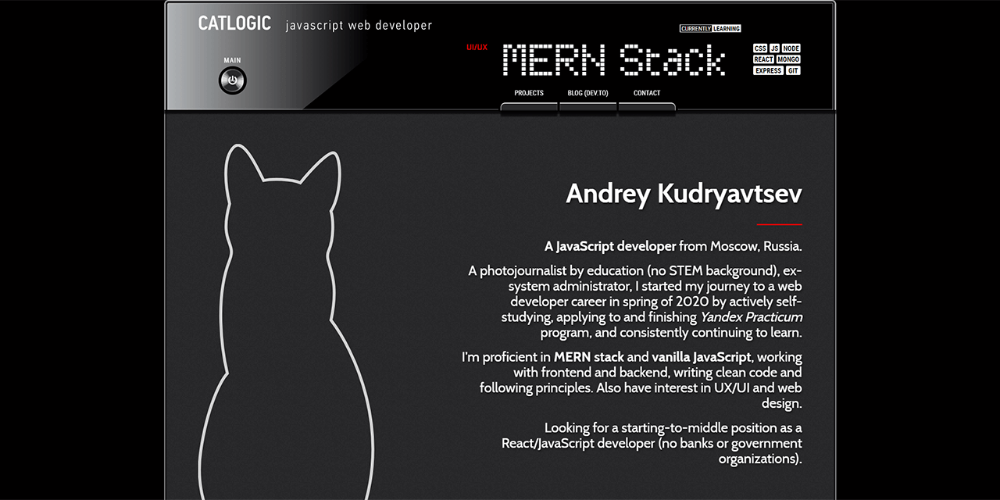

# catlogic.ru
**My personal portfolio**

## About

A personal portfolio with my info and most recent projects.

### Latest update

* 09.01.2021 - converted to React, added blog posts previews, splitted components by routes, optimized build.

## Tech used

* Semantic and accessible **HTML5**, **CSS3** (Flexbox, Grid).
* Fully responsive layout, optimized for screen resolution from 320px by width.
* **JavaScript ES6** syntax.
* **React** frontend (hooks, state, router).
* Works with external APIs for submitting contact form (*99inbound.com*) and fetching blog posts data from *Dev.to*.
* Code style by *ESLint* in *airbnb-base* config.
* Naming & components structure by **BEM**.
